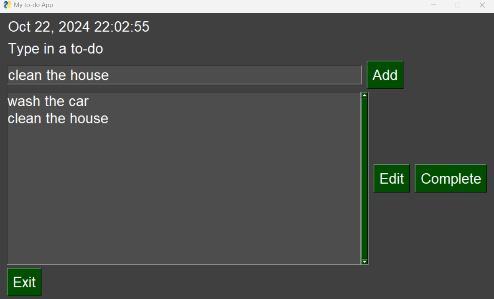

<h1 align="center"> 
My first Python Project</h1>

<h2 align="center"> 
This project should run on the terminal gui, locally. </h2>

# Sample photos:

<h4>GUI ScreenShot 1</h4>

<h4>GUI ScreenShot 2</h4>

<h4>GUI ScreenShot 3</h4>

<h4>GUI ScreenShot 4</h4>

